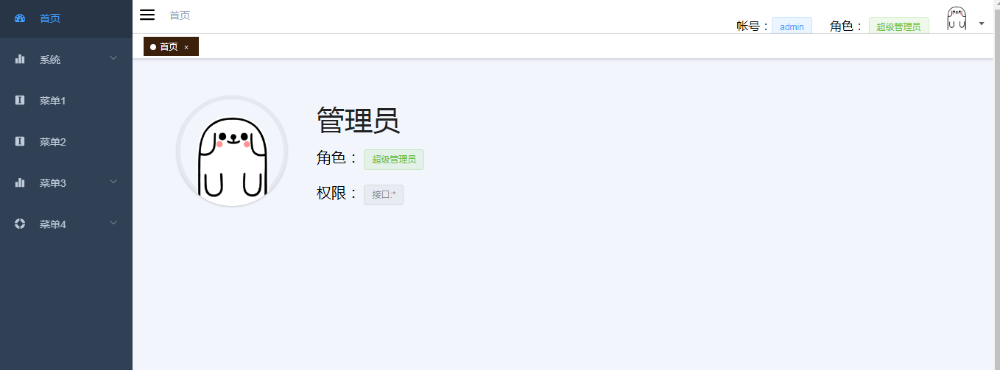
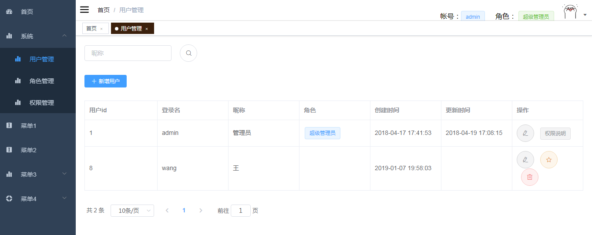
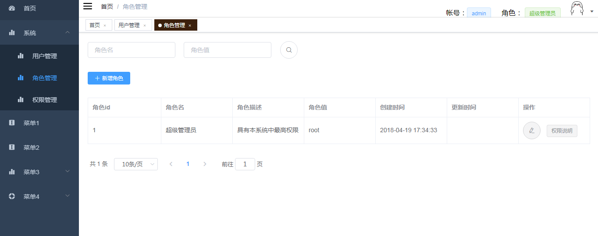
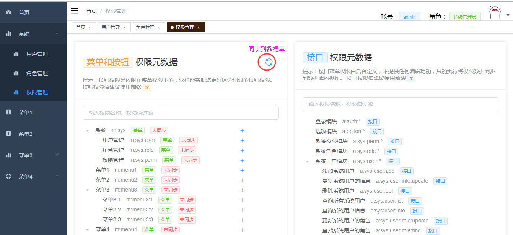
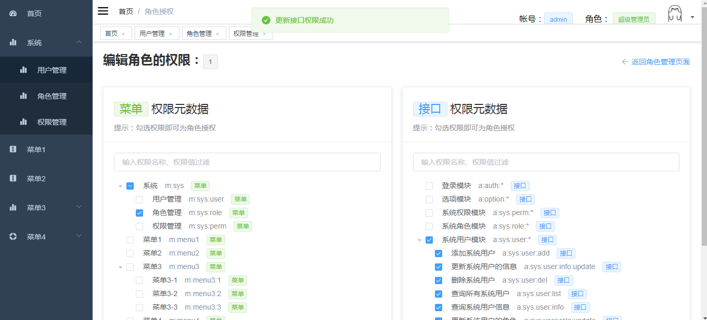
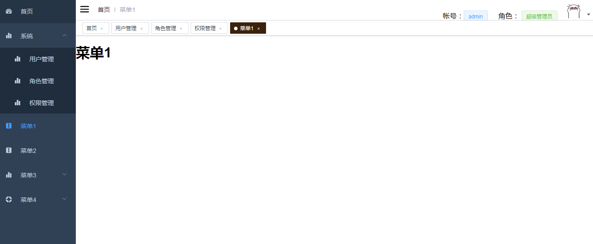

# Auth-All

>Auth-All是在一个叫biu的脚手架基础上优化而来，是一个基于Spring Boot和Vue的Web开发脚手架，整合和最基础的RBAC权限控制，包括：菜单权限、按钮权限、接口权限。
- 前端使用vue-cli，后端使用Spring Boot，两个全家桶强强联合。
- 用简单优雅的方式整合shiro
- 使用Maven持续构建特性，开发时修改java代码无需重启
- 使用vue-element-admin做前端模板，摆脱写jQuery的痛苦
- 多种灵活形式的前后端分离方式，包括开发阶段的前后端分离和部署的前后端分离

本框架优化点：
~~~
- 接口权限不再保存到权限表，而是实时从@PermInfo注解获取，这样的好处是省去了新加接口同步的问题
  接口顶层模块配置必须以'*'号结尾,以此来判断是否是父节点，例如用户模块： a:user:*，增加用户a:user:add
- 将菜单和按钮权限合二为一
- 优化配置文件
- 支持Redis缓存Session和权限，具体看ShiroConfig配置，需要打开某些注释项
~~~

**效果图：**

## 如何开始开发

请先安装好依赖的开发环境：Java8、Maven、Node.js、vue-cli。我自己使用的是Gradle4.6，Node8.11.1，vue-cli 2.9.3，建议使用Intellij IDEA。

克隆项目到本地：

~~~
git clone https://github.com/wangjc1/Auth-All
~~~

执行`_sql/data.sql`导入mysql数据库

下载好依赖后，我们还需要下载Auth-Front模块的依赖。在IDEA左下角打开一个Terminal命令行终端。`cd Auth-Front`然后`npm install`，等待依赖安装完成。

然后再新建两个Terminal命令行终端，即一共建三个命令行终端。

在第1个终端输入：
~~~
cd Auth-Front
npm install
~~~
启动Maven的持续构建

在第2个终端输入：
~~~
cd Auth-Server
mvn package
~~~
启动spring boot。有时候由于持续构建没有编译好，会导致spring boot启动失败。多试几次就行。

安装Node和Vue：
~~~
下载nodejs，版本太高安装webpack会报错： 
http://nodejs.cn/ 解压后在环境变量path中添加安装路径
安装Vue：
npm install -g cnpm --registry=https://registry.npm.taobao.org
~~~

在第3个终端输入：
~~~
cd Auth-Front
cnpm run dev
~~~
启动spring boot。有时候由于持续构建没有编译好，会导致spring boot启动失败。多试几次就行。

待三个终端都启动完成，在浏览器页面访问前端页面：`http://localhost:9527`，页面上的ajax请求会转发到java后台的`8888`端口。

后端模块`Auth-Server`由于使用了Maven的持续构建，当我们编辑任何java代码时候，就会触发构建，spring boot会自动重新加载，无需我们自己手动重启。
 
## 如何部署

**打包Auth-Server模块：**
~~~
cd Auth-Server
mvn package
~~~
 